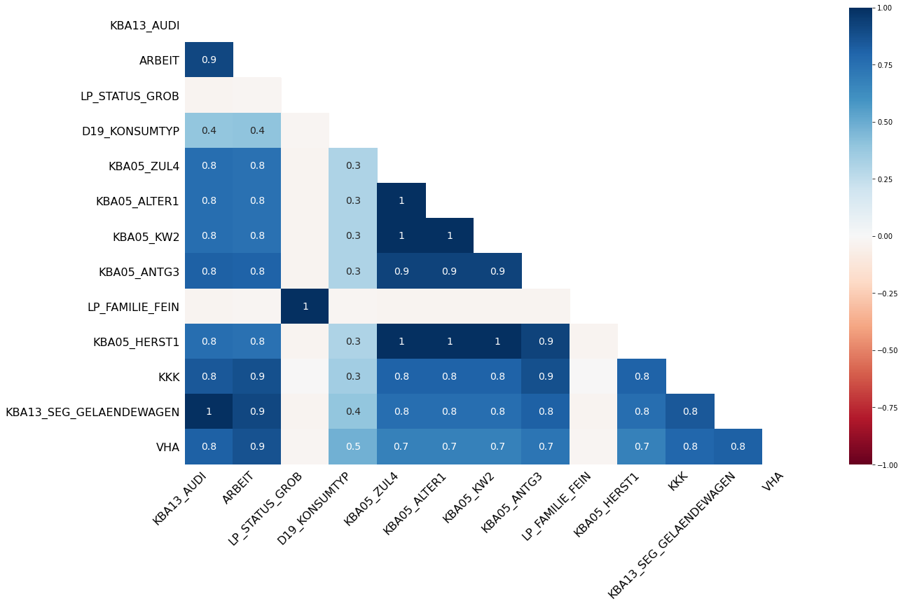

# Capstone Project

*Machine Learning Engineer Nanodegree*  
Diego García Lozano  
2020-04-19

<p align="center">
  
</p>

# Definition

## Project Overview

**Customer segmentation** is a typical problem in many business cases. Imagine we are leading a company and we want to attract people by making marketing campaigns or offering different discounts. Will we offer them to everybody? Is everybody likely to become a new company customer?

In this project I have developed a possible solution for classifying people, to know whether they will become a new customer or not by responding a marketing campaign. It consists on a supervised classification Machine Learning model. For this purpose I have made use of different datasets given by **Arvato**. I will explain more about Arvato and their datasets later in this report.

<p align="center">
  
</p>

## Problem Statement

Arvato, which is a company that provides **financial solutions**, has a problem that consists on create a **customer segmentation**. We are going to cover some steps to solve that problem:

- We have available different **demographic data** from both customers and non-customers (german people), so first we'll download them
- Then we need to provide **insights** in order to know what kind of people is more likely to become a customer  
- After that, we will develop a **supervised machine learning model** to classify people with different characteristics and predict whether they will respond to a marketing campaign or not
- Finally, we will upload some solutions with test data to **Kaggle** in order to check our accuracy and compare with other people


## Metrics

The area under ROC curve is going to be used to measure the behaviour of the model. Why? Let's check some keys:

- The metric used in the Kaggle competition associated is ROC AUC, so this is the main reason to use it
- The problem that we want to cover is customer segmentation. We have data from people and our task is to predict whether a person is a potential customer or not. What could we do with this information? Maybe, we could launch some marketing campaign to attract new customers. For this purpose, we should establish a ranking to know which people is more likely to become a customer. What's more, we are in front of an imbalanced problem, so with ROC AUC we are taking this fact into mind

To calculate the ROC curve, first we need to calculate the False Positive Rate (FPR) and the True Positive Rate (TPR) for different thresholds. Once calculated, we just need to sum up the area under de curve to obtain the ROC AUC.

<p align="center">
  
</p>

# Analysis

## Data Exploration

We have several datasets available to resolve this problem, so let's explain them:

- *azdias*: it consists on 891221 rows where each one represents a german person. Each of them has 366 features
- *customers*: it consists on 191652 rows where each one represents a customer. Each of them has 369 features, so it has 3 new features

- *train*: it consists on 42962 rows where each one represents a person. Each of them has 367 features, where one, *RESPONSE*, tell us if that person is has responded to a marketing campaign

- *test*: it consists on 42833 rows where each one represents a person. Each of them has 366 features and, in this case, we need to predict whether the person will respond to the marketing campaign or not

We need to take some things into account:
- All datasets have 366 features in common, those which are provided in *azdias* and *test*
- We are not going to use the 3 extra columns in customers. They are not going to give us any information to solve our problem because (obviously) they are not available for non customers
- There are many nulls. If we take a look at features descriptions, -1 also represents a NaN value. The same happens in some cases with 0 or 9. Taking this into mind, each dataset has the following number of null values:
  - *azdias*: 7092784
  - *customers*: 2842122
  - *train*: 2279616
  - *test*: 2248276

  So to solve this, we can use several approaches:
  - Remove both columns and rows with more than a threshold number of nulls
  - Fill them with some statistics values: mean or median in numerical features, mode in categorical ones...
  - Let them and use some algorithm that can take advantage of this, like XGBoost or CatBoost. Also, if there are so many nulls, they could follow a pattern. So we could generate new features from those null values

- There are many categorical features: many of them have been already encoded, substituting them by a numerical value after cutting them into bins. There are also some columns that have not been encoded yet, like *CAMEO_DEU_2015*. There are several approaches to solve this:
  - Use CatBoost, because it encode categorical features by itself
  - Use label encoding, substituting each category by a numerical value
  - Use one hot encoding and generate a new column for each category
  - Use target encoding and substitute each category by a numerical value taking into account the target value
- There is a datetime feature, *EINGEFUEGT_AM*. We could extract some new features, like:
  - Day: [1, 31]
  - Weekday: [0, 6]
  - Month: [1, 12]
  - Year: [1960, 2020] (for example)

To sum up, dtypes in the Pandas DataFrame are like the following table. We have taken train for this example:

|      dtype     	| number 	|
|:--------------:	|:------:	|
|     float64    	|   273  	|
|      int64     	|   90   	|
|     object     	|    3   	|
| datetime64[ns] 	|    1   	|

## Exploratory Visualization

There are many numerical features. So it seems difficult and irrelevant to draw and visualize each feature. So let's check other factors, like missing values and correlation between features.

### Missing values

#### *azdias* null matrix
<p align="center">
  
</p>

#### *customers* null matrix
<p align="center">
  
</p>

It seems there are some rows with many null values in both *azdias* and *customers* datasets.

Some columns seems completely null, so they could follow a pattern.

#### Correlation between nulls

#### *azdias* correlation null matrix
<p align="center">
  
</p>

#### *customers* correlation null matrix
<p align="center">
  
</p>

With this plot we can see some relationships between features in terms of null values. Because of time of computation, we have selected 20 random features to see their interactions.

It seems that some features, like *LP_FAMILIE_FEIN* have almost always same correlation with other characteristics.

### Correlation matrix

#### *azdias* correlation matrix
<p align="center">
  
</p>

#### *customers* correlation matrix
<p align="center">
  
</p>

It seems that there are a highly positive correlation in *customers* features, while those are negative correlation in *azdias*.

## Algorithms and Techniques

Several techniques have been used to solve this problem. We can sum up them in some key points:

- Statistics: algorithms used for get statistics insights. For example, comparing distributions
- Classification: algorithms used for classifying data
- Validation: we don't have test labels. What's more, we are competing in Kaggle, so we need to establish a good validation method to see if our results are good enough before uploading them to Kaggle platform

### Statistics
In statistics problems, sometimes we want to compare distributions from features in different datasets, to see if we can use them for modelling.  
For example, in this case, we are competing in Kaggle, so they provide us both train and test datasets. We are going to fit our model with the train dataset and we are going to check its performance with test set. If some features follow different distributions in train and test set, the model performance will decrease.  
To solve this, we can use statistical tests to check if features from both datasets follow same distributions. In this case, almost all variables are numerical, so we are going to use the two-sample Kolmogorov-Smirnov test. This is a two-sided test for the null hypothesis that 2 independent samples are drawn from the same continuous distribution.

### Classification
CatBoost is a Machine Learning model for gradient boosting on decision trees developed by Yandex.
It's a well known library for obtaining high scores in Kaggle competitions. Its main key points are the following:
- Scalability
- Categorical features compatibility
- Null values compatibility
- Fast predictions

<p align="center">
  
</p>

### Validation
As we said before, we need to establish a good validation method. We could just split our train dataset in train and test parts, but our case is highly imbalanced. We just have available about 500 positive response cases.  

To avoid conclusions made from randomness, we are better going to use cross validation method.
1. Split our dataset in N folds (5 in this case). Because we are in an imbalanced problem, our folds need to be stratified, i.e. have same target distribution in each fold
2. Get N-1 folds and use them for training our model
3. Use the remain fold for testing
4. Go to step 2, but changing the folds

To get this, we could use scikit-learn and its cross validation methods:

``` python
from sklearn.model_selection import cross_val_score, StratifiedKFold


skf = StratifiedKFold(n_splits=5,
                      shuffle=True,
                      random_state=SEED)
scores = cross_val_score(model,
                         X, y,
                         cv=skf,
                         scoring='auc')
print(f'AUC CV: {scores.mean()} ± {scores.std()}')

```

But fortunately, CatBoost provides us its own cross validation method.

``` python
from catboost import cv


results = cv(pool, fold_count=5,
             stratified=True, seed=SEED)
print(results)
```

<p align="center">
  
</p>

## Benchmark

We can take a look at two key points to establish a benchmark for this problem:

- Because we are using ROC AUC to measure our model performance, we need to obtain more than a 50%. Why? A 0.5 result in ROC AUC means that we are obtaining same results as randomness. We can see the a 0.5 result in [metrics](##Metrics) (the diagonal line)

- It seems easy to define a benchmark or a threshold for this problem, because of the fact that it has a Kaggle competition associated.

Let's take a look at Kaggle Leaderboard:

Five top Kagglers have over 80%


Five worst Kagglers have about 50%


Indeed, there are more Kagglers below those, but they have less than 50%, so I have not considered them, because maybe there's something wrong in their submissions.

So it seems reasonable to obtain a ROC AUC between 0.6 and 0.8 to get, at least, the middle of the leaderboard.

# Methodology

## Data Preprocessing

Several preprocessing steps have been made in this problem. Let's explain them, dividing in different blocks. For this steps, we have made used of Pandas, a Python library for data wrangling.

#### 1. Visualization
- We have taken a sample of each dataset, *azdias* and *customers* and have taken a look at some of their features. We have observed that both of them have many null values and some strange values in numerical features like 'X' and 'XX'
- We looked at features description, provided by Arvato, defining each feature and its values. With this information, we have defined -1 as a null value and, in some cases, 0 and/or 9
- We have observed that there is a datetime column, *EINGEFUEGT_AM* that we have to process so we have converted it to datetime format
- Many of the columns are categorical but they are already encoded as numerical ones
- A few cols are categorical, so later we'll encode them
- We have made some plots based on null values and correlation between features. They are available in *Exploratory Visualization* part

#### 2. Statistics
- We have compared the proportion of nulls present in each dataset (*azdias* vs *customers*) based on a threshold. We have discovered that there are two features that differ more than a 20% in number of nulls. Due to they are just two, we have decided to leave them for now. They are *AGER_TYP* and *EXTSEL992*
- We have checked if the distributions in numerical features from *azdias* vs *customers* are the same with a two-sample Kolmogorov-Smirnov test. We have discovered that there are 12 features that follows same distributions, so maybe they cannot give us any information to differ potential customers from others. Again, 12 features are a few, because there are 350 columns with different distributions, so for now we'll leave them
- We have establish a threshold to drop some features based on their null values. We have used 40%, i.e. we have drop those features with more than a 40% of nulls in both *azdias* and *customers*. With this method, we have dropped 7 features

#### 3. Add/drop features
- We have created new features based on *EINGEFUEGT_AM* feature, like day, month, year and weekday. Because there are also other year features, we have calculated combinations between those year features
- We have dropped some columns based on first insights made
- We have added null indicators for every feature, i.e. whether each value is null or not
- We fill null values with -999 number and configure CatBoost to get minimal values as null ones.


## Implementation

Once the preprocessing techniques and functions were defined, we have to apply them to our datasets. In this case, we have available 4 datasets: *azdias*, *customers*, *train* and *test*.  
We have to extract insights from *azdias* and *customers* (we have already explained it). After that, we have to train the model with *train* data. We have a problem here: *train* is a highly imbalanced dataset. It has available about 500 positive cases in 42962 examples, so that make us think if we could use both *azdias* and *customers* datasets to train the model, so first we are going to try this approach. This way, we have available 191652 positive cases from 1082873 total rows (891221 from *azdias* + 191652 from *customers*). To sum up:
- In *train* data, we have a proportion of about 81 non-customers per customer
- In *azdias* + *customers* we have a proportion of about 8 non-customers per customer, 10 times less!

Finally, we have trained our CatBoost model in the following way:
- We have check its performance in *azdias* + *customers* in cross validation with 5 folds, checking its ROC AUC
- Once checked that the model works well, we have fitted it with all data
- We have make predictions of *test* data and upload them to Kaggle
- To have a comparison, we have check cross validation performance in *train* data, also with ROC AUC metric

Let's also talk about some problems in coding processes:
- I was a bit blocked until I discovered that some numerical columns had values like 'X' and 'XX', but Pandas did not get them because of the parameter *low_memory* in *pandas.read_csv()*, where it only process a chunk of data to infer dtypes of features
- When filling null data with -999 with pandas.DataFrame().fillna(), the parameter *downcast* is *True* by default, so Pandas tried to downcast features in this order: *object* -> float -> int. In my case, is not always what I want to do, so I had to change it to *False*


## Refinement

We have made some iterations before reaching final solution:
- Adjusting max_depth and iterations parameters in CatBoost model
- Train with just 20% of data in *azdias* and *customers*. It seems that this sampling reach same performance as training with 100% of data
- In Kaggle competition, we are provided with two datasets, *train* and *test*. We have also fit our model in *train* dataset and check its performance in cross validation. We will cover these results in *Results* section

To sum up our initial and final solution:

#### Initial solution
- Just fitting a CatBoost classifier with default parameters.
- Not extracting datetime features and treating the datetime feature as a categorical one
- Not creating new features based on null values
- Not dropping neither null features nor null examples
- Using 100% of data

#### Final solution
- Fitting CabBoost classifier with specific parameters
- Creating new datetime features
- Creating new features, based on null values (null indicators) and combinations with years
- Dropping null features
- Using 20% of data

# Results

## Model Evaluation and Validation

Once fitted the model, we are going to extract some interpretations with SHAP values. But first, we are going to check how is its performance:

| dataset                | AUC    | Notes            |
|:----------------------:|:------:|:----------------:|
| *azdias* + *customers* | 0.9196 | Cross Validation |
| *train*                | 0.7674 | Cross Validation |
| *test*                 | 0.7973 | Kaggle Public LB |

We can see final test results in Kaggle:
<p align="center">
  
</p>

So now, let's check interpretation with SHAP values:
<p align="center">
  
</p>

*D19_SOZIALES* seems to be the most important feature. That feature is not defined in features information file. If we take a look at it, we see that is a numerical feature and its possible values and their frequency are the following:

| value | frequency |
|:-----:|:---------:|
|  0.0  |  106000   |
|  1.0  |   24947   |
|  4.0  |    8406   |
|  5.0  |    7462   |
|  3.0  |    5225   |
|  2.0  |    4111   |

If we take a look at SHAP plot, we can see that there are many examples that, with a high value in *D19_SOZIALE*, are more likely to have a higher target, i.e. are more likely to have a response in marketing campaign.  
It would be better to know the exact definition of the variable, but we can infer that it's something related with a social or economic class, so it make sense that richer people are more likely to become a customer in a company.

## Justification

If we take a look at the *Benchmarking* section, we have said that a ROC AUC between 0.60 and 0.80 would be a good result. In Kaggle competition, as we said in *Model Evaluation and Validation* section, we can see that we have obtained a 0.7973 ROC AUC, almost 0.8, so we have obtain a good result.  
If we look at Kaggle Leaderboard, we have reach a position situated in the 40% of the table.  
We have to be careful with those values, because Kaggle leaderboard performance is measured in the public data from *test* dataset and, in this case, is 30%. But it's probable that our performance would be the same in private leaderboard (70%) because of the cross validation result in *train*.

In general, our performance in ROC AUC seems to be good enough to use in production.
